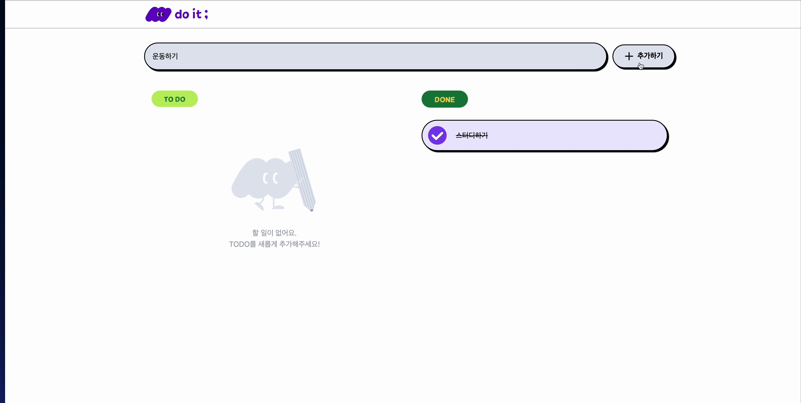

# 🧩 Do It! Todo List

## 🎯 서비스 소개

사용자가 할 일(todo list)을 관리하고, 완료된 일은 **done** 리스트로 이동하여 작업을 효율적으로 관리할 수 있는 Todo List 애플리케이션입니다.

🌟 [**CodeIt Todo List 바로 가기**](https://codeit-todolist-ten.vercel.app) 🌟

- **할 일(todo)**: 사용자가 해야 할 일들이 나열됩니다.
- **완료한 일(done)**: 완료된 일은 "done" 목록으로 이동하여 사용자가 작업을 추적할 수 있게 도와줍니다.

## 🔎 주요 기능

- 1️⃣ Todo 항목 CRUD 기능
- 2️⃣ 상세페이지에서 Todo항목 관련 이미지를 등록할 수 있으며,
  메모 추가 기능을 제공하여 추가적인 정보를 입력할 수 있습니다.
- 3️⃣ 실시간 상태 업데이트
- 4️⃣ 웹, 테블릿, 모바일 앱에서 적용 가능한 반응형 디자인

## 🔧 기술 스택

## 📺 기능 소개

### 메인 페이지

- 해야 할 일인 todo와 완료된 일인 done을 구분하여 확인할 수 있습니다.
- 상단 입력창에 할 일을 입력한 후 추가 버튼을 클릭하면 할 일이 생성됩니다.
- 할 일을 클릭하면 해당 항목의 상세 페이지로 이동합니다.
- 로고를 클릭하면 메인페이지로 이동합니다.

### 상세 페이지

<!--  -->

- 상세 페이지에서는 할 일에 대한 이미지와 메모를 입력할 수 있습니다.
- 등록한 이미지와 메모는 수정하거나 삭제할 수 있습니다.
- 할 일을 삭제하게 되면, 삭제 후 자동으로 메인페이지로 이동합니다.
- 상세 페이지에서도 할 일의 완료 여부를 변경할 수 있습니다.
- 메모가 특정 길이를 초과하면 자동으로 스크롤됩니다.

<!-- ### 반응형

 -->
